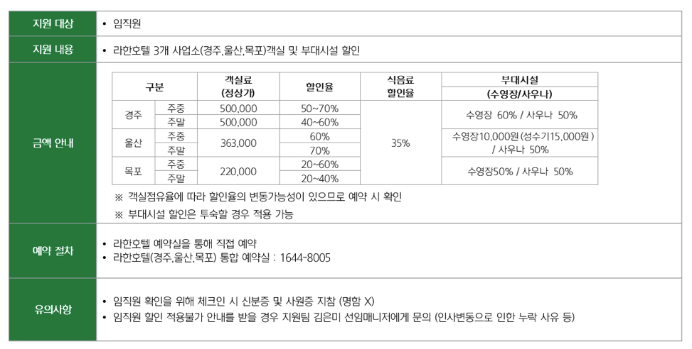

# Paddle OCR

## Paddle OCR Rust

[paddle-ocr](https://github.com/aws-samples/sample-aws-idp-pipeline/tree/main/packages/lambda/paddle-ocr) 기준으로 Paddle OCR을 적용합니다. 이 repository는 [Rust PaddleOCR](https://github.com/zibo-chen/rust-paddle-ocr)을 베이스로 하고 있습니다.

## Paddle OCR 3

[PaddleOCR](https://github.com/PaddlePaddle/PaddleOCR) 적용시의 동작은 아래와 같습니다. 문제는 성능이 Paddle OCR Rust에 비해 확연히 떨어집니다.

### 설치

- CPU 전용

```text
python -m pip install paddlepaddle==3.2.0 -i https://www.paddlepaddle.org.cn/packages/stable/cpu/
```

- GPU 사용 (CUDA 12.6)

```text
python -m pip install paddlepaddle-gpu==3.2.0 -i https://www.paddlepaddle.org.cn/packages/stable/cu126/
```

- 설치 확인 방법

```text
python -c "import paddle; print(paddle.__version__)"
```

### 활용 방법

- 기본 OCR

```python
from paddleocr import PaddleOCR

ocr = PaddleOCR(
    use_doc_orientation_classify=False,
    use_doc_unwarping=False,
    use_textline_orientation=False
)

result = ocr.predict("./image.png")

for res in result:
    res.print()                    # 결과 출력
    res.save_to_img("output")      # 시각화 이미지 저장
    res.save_to_json("output")     # JSON으로 저장
```

- 문서 구조 분석 (PDF/이미지 → Markdown/JSON)

```python
from paddleocr import PPStructureV3

pipeline = PPStructureV3(
    use_doc_orientation_classify=False,
    use_doc_unwarping=False
)

output = pipeline.predict(input="./document.png")

for res in output:
    res.print()
    res.save_to_json(save_path="output")
    res.save_to_markdown(save_path="output")
```

- 텍스트 감지 / 인식 개별 사용

```python
from paddleocr import TextDetection, TextRecognition

det_model = TextDetection()
det_output = det_model.predict("image.png")

rec_model = TextRecognition()
rec_output = rec_model.predict("image.png")
```


## Deploy

여기서는 [Rust PaddleOCR](https://github.com/zibo-chen/rust-paddle-ocr)을 활용하여 [paddle-ocr](https://github.com/aws-samples/sample-aws-idp-pipeline/tree/main/packages/lambda/paddle-ocr)을 기준으로 구현됩니다.

### 구조

```
paddle-ocr/                  # full 모드 — Rust + MNN 기반 OCR
├── Dockerfile               # Docker 이미지 정의 (Rust 멀티스테이지 빌드)
├── Cargo.toml               # Rust 의존성 정의
├── Cargo.lock
├── src/
│   ├── bin/cli.rs           # CLI 진입점 (S3 경로를 받아 OCR 수행 후 JSON 출력)
│   ├── lib.rs               # 이미지/PDF 처리 로직
│   ├── engine.rs            # OCR 엔진 초기화 (ocr-rs + MNN 모델, 다국어 지원)
│   └── s3.rs                # S3 다운로드 유틸리티
└── models/                  # MNN 모델 파일 (PP-OCRv5 detection/recognition, 다국어)
paddle-ocr3/                 # light 모드 — Python + PaddleOCR 3.x 기반 OCR
├── Dockerfile               # PaddleOCR 3.0 + paddleocr==3.4.0 이미지
└── run_ocr.py               # PP-OCRv5 한국어 OCR 스크립트 (신뢰도 필터링 포함)
app/
├── run.py                   # 로컬 파일을 S3에 업로드 후 Docker 컨테이너에 OCR 요청
└── config.json              # S3 버킷 등 AWS 설정
```

### OCR 모드

`app/run.py`는 환경변수 `OCR_MODE`로 두 가지 모드를 지원합니다.

| 모드 | `OCR_MODE` | Docker 이미지 | 엔진 | 특징 |
|---|---|---|---|---|
| **full** (기본값) | `full` 또는 미설정 | `my-paddleocr` | Rust + MNN | 빠른 추론, PDF 지원, 다국어 모델 내장 |
| **light** | `light` | `my-paddleocr-light` | Python + PaddleOCR 3.x | PP-OCRv5 서버 모델, 신뢰도 필터링 |

### 1. Docker 이미지 빌드

#### full 모드 (Rust/MNN)

[`paddle-ocr/Dockerfile`](./paddle-ocr/Dockerfile)을 이용해 반드시 프로젝트 **루트 디렉토리**에서 빌드합니다.

```text
docker build -t my-paddleocr ./paddle-ocr
```

> - Apple Silicon(M1/M2/M3) Mac에서도 네이티브 아키텍처로 빌드됩니다 (`--platform` 불필요).
> - `app/` 등 하위 디렉토리에서 실행하면 경로를 찾지 못합니다. 반드시 루트에서 실행하세요.

#### light 모드 (Python/PaddleOCR)

[`paddle-ocr3/Dockerfile`](./paddle-ocr3/Dockerfile)을 이용해 빌드합니다.

```text
docker build --platform linux/amd64 -t my-paddleocr-light ./paddle-ocr3
```

> - PaddleOCR Python 패키지는 `linux/amd64` 환경을 대상으로 합니다.

### 2. AWS 자격증명 설정

`~/.aws` 디렉토리의 자격증명을 사용합니다. 설정되어 있지 않은 경우 아래 명령어로 초기화합니다.

```text
aws configure
```

특정 프로파일을 사용하려면 환경변수를 설정합니다.

```text
export AWS_PROFILE=<profile-name>
```

### 3. OCR 실행

`app/run.py`를 통해 실행합니다. 로컬 파일을 전달하면 S3(`ocr/` 폴더)에 자동 업로드 후 OCR을 수행합니다.

```text
# 로컬 파일 → S3 업로드 → OCR (full 모드, 기본값)
python app/run.py /path/to/image.jpg

# S3 경로를 직접 지정
python app/run.py s3://<bucket>/<key>

# light 모드로 실행
OCR_MODE=light python app/run.py /path/to/image.jpg
```

#### 실행 흐름 (full 모드)

1. 로컬 파일이면 S3 `ocr/<filename>`으로 업로드 (이미 존재하면 스킵)
2. `docker ps`로 데몬 컨테이너(`my-paddleocr-daemon`) 실행 여부 확인
3. 컨테이너가 없으면 자동으로 시작 (`~/.aws`를 읽기 전용으로 마운트)
4. `docker exec`으로 컨테이너 내 Rust CLI(`/paddle/cli`) 실행
5. 결과를 JSON으로 출력 (`"result"` 키에 줄바꿈으로 구분된 텍스트 포함)

#### 실행 흐름 (light 모드)

1. 로컬 파일이면 S3 `ocr/<filename>`으로 업로드 (이미 존재하면 스킵)
2. `docker ps`로 데몬 컨테이너(`my-paddleocr-light-daemon`) 실행 여부 확인
3. 컨테이너가 없으면 자동으로 시작
4. `docker exec`으로 컨테이너 내 `python run_ocr.py` 실행 (PP-OCRv5 서버 모델, 신뢰도 0.7 이상만 반환)
5. 결과를 JSON으로 출력

#### 출력 예시

```json
{
  "result": "지원 대상\n임직원\n지원 내용\n주중 20~40% 220,000"
}
```

#### 이미지 재빌드

이미지가 없거나 플랫폼이 맞지 않을 경우 아래와 같이 안내 메시지가 출력됩니다.

```text
[Error] Image 'my-paddleocr' exists but was built for a different platform.

Run the following command to build the Docker image first:

  docker build -t my-paddleocr /path/to/paddle-ocr/paddle-ocr
```

기존 컨테이너·이미지를 정리 후 프로젝트 루트에서 재빌드합니다.

```text
# full 모드
docker rm -f my-paddleocr-daemon
docker rmi my-paddleocr
docker build -t my-paddleocr ./paddle-ocr

# light 모드
docker rm -f my-paddleocr-light-daemon
docker rmi my-paddleocr-light
docker build --platform linux/amd64 -t my-paddleocr-light ./paddle-ocr3
```

### 설정 파일

`app/config.json`에서 S3 버킷 및 AWS 리전을 관리합니다.

```json
{
  "region": "us-west-2",
  "s3_bucket": "<bucket-name>"
}
```

### 다국어 지원 (full 모드)

`paddle-ocr/src/engine.rs`에 정의된 언어 목록을 기반으로 MNN 모델이 선택됩니다.

| 언어 | 코드 | 모델 |
|---|---|---|
| 한국어 | `ko`, `korean` | `korean_PP-OCRv5_mobile_rec_infer.mnn` |
| 영어 | `en` | `en_PP-OCRv5_mobile_rec_infer.mnn` |
| 중국어 | `zh`, `ch` | `ch_PP-OCRv4_rec_infer.mnn` |
| 아랍어 | `ar` | `arabic_PP-OCRv5_mobile_rec_infer.mnn` |
| 키릴 문자 | `ru` 외 다수 | `cyrillic_PP-OCRv5_mobile_rec_infer.mnn` |
| 데바나가리 | `hi` 외 다수 | `devanagari_PP-OCRv5_mobile_rec_infer.mnn` |
| 그리스어 | `el` | `el_PP-OCRv5_mobile_rec_infer.mnn` |
| 라틴 | `la`, `fr`, `de` 외 다수 | `latin_PP-OCRv5_mobile_rec_infer.mnn` |
| 타밀어 | `ta` | `ta_PP-OCRv5_mobile_rec_infer.mnn` |
| 텔루구어 | `te` | `te_PP-OCRv5_mobile_rec_infer.mnn` |
| 태국어 | `th` | `th_PP-OCRv5_mobile_rec_infer.mnn` |

검출 모델은 공통으로 `PP-OCRv5_server_det.mnn`을 사용합니다.

### 실행 결과

 을 아래와 같이 입력으로 넣습니다.

```text
python app/run.py app/complex_parsing_hotel_info.png
```

결과는 아래와 같습니다.

```text
지원 대상
임직원
지원 내용
•라한호텔 3개 사업소(경주,울산,목포)객실 및 부대시설할인
식음료
객실료
부대시실
구분
할인율
(정상개)
할인율
(수영장/사우나)
주중
500,000
50~70%
경주
수영장 60%/사우나50%
주말
500,000
40~60%
주중
60%
수영장10,000원(성수기15,000원)
울산
35%
금액 안내
363,000
주말
70%
/사우나50%
추중
20~60%
목포
220,000
수영장50%/사우나50%
주말
20~40%
※객실점유율에 따라할인율의 변동가능성이 있으므로 예약시확인
※부대시설할인은투숙할경우 적용가능
•라한호텔예약실을통해 직접 예약
예약 절차
·라한호텔(경주,울산,목포) 통합 예약실:1644-8005
•임직원확인을위해체크인시신분증 및사원증지참(명함×)
유의사항
임직원할인 적용불가 안내를받을경우 지원팀 김은미 선임매니저에게문의(인사변동으로인한누락사유등)
```

Paddle OCR의 결과는 만족스럽지 않습니다.

반면에 Claude Sonnet 3.6으로 markdown으로 분석한 결과는 아래와 같이 표를 적절하게 분석해줍니다.


